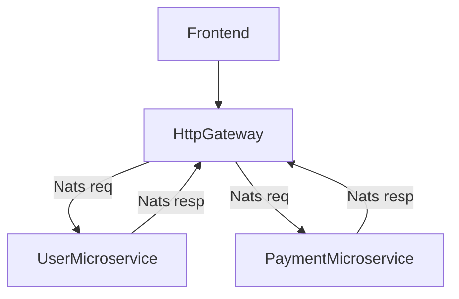

# nest-js-studying: Payment user application

## Introduction

This is a simple microservice architecture that defines an application for handle payments for the user defined inside the living software.

## Setup, run and requirments

In Linux Ubuntu or WSL platform, do the following.

### Locally

Deploy the complete app is using docker-compose

Check [here](https://docs.docker.com/compose/install/) how to install docker-compose.

Then `docker-compose up --build`

Access to the frontend, via `http://localhost:8080`

## What you should see

You should expect a view for Login or Register.

If you want to log with the admin user (already defined in the app setup), enter `admin` as username and `admin` as password.

This admin can:

* Create users
* Create payments for its own
* List Users
* List Payments
  
Otherwise you can register in the app, and you will be automatically redirected to an user dahsboard view. There you can:

* List your payments
* See your user details
* Create payments based on your balance

## Architecture definition

We have 4 apps inside the [apps](https://gitlab.musala.com/alejandro.diaz/nest-js-studying/-/tree/main/apps/main) folder:

* [Frontend](#fronted)
* [Http Gateway](#http-gateway)
* [Payment Microservice](#payment-microservice)
* [User Microservice](#user-microservice)

## Logic Diagram

## Fronted

In the frontend we have the view of the application. This code stores the user session, in form of a JWT, using redux. This token is used to determine what dashboard to show to the user, either Admin, or common User. The forms for the creation of information have the corresponding validations.

## Http Gateway

As the [Logic diagram](#logic-diagram) shows, this is the microservice which connects the backend with the external ecosystem exposing the corresponding endpoints. The communication between the http-gateway and the rest of microservices is using the nats protocol.

## Payment Microservice

The Payment Microservice has the logic definitions for creating payments associated to users. Here all the needed validations are taken in consideration to handle the payment creation.

## User Microservice

The user microservice is responsible for creating and listing users.

